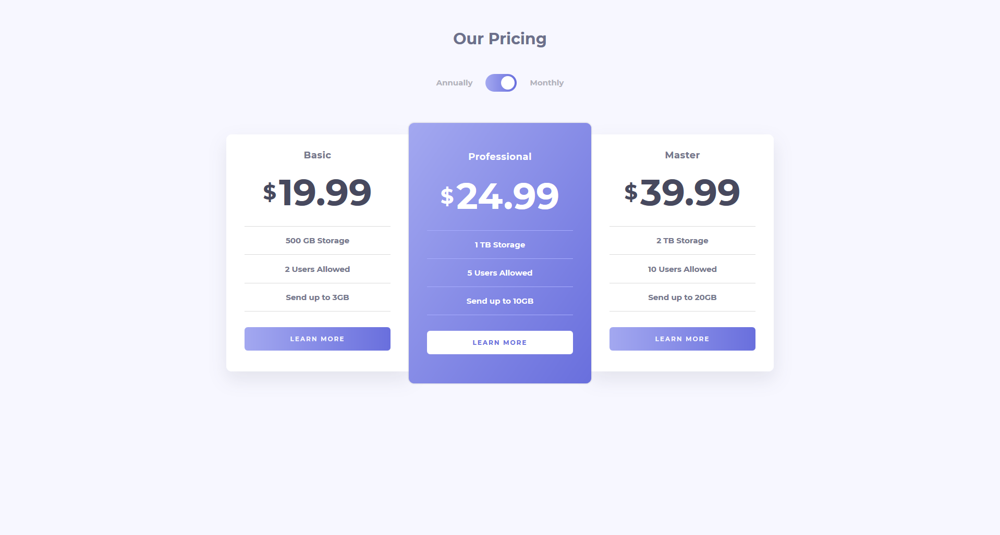
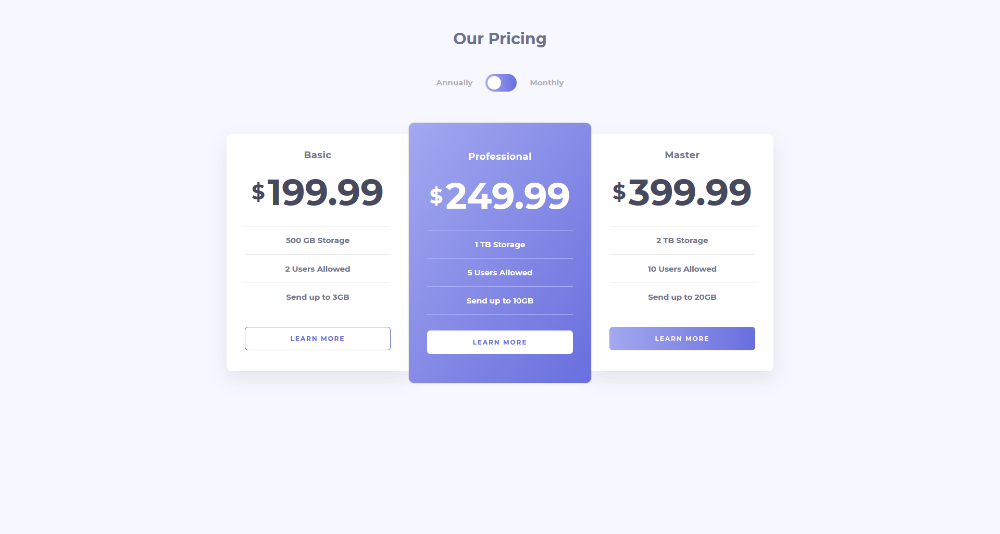
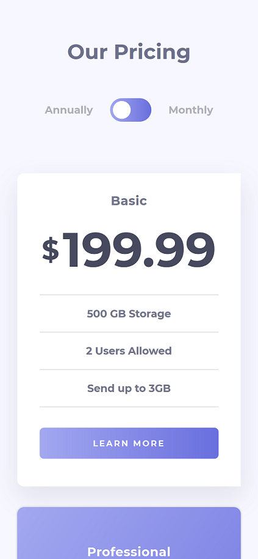

# Pricing Component

## TL;DR

My solution to this Frontend Mentor challenge was built using [Gatsby](https://www.gatsbyjs.com/). It is fully responsive and all styling was done using sass.

## Deployed Site

[Check it out on Netlify](https://ts-pricing-component.netlify.app/)

## Local development

After cloning this repo and installing necessary modules with `yarn install`, you have the following scripts available to you:

- `yarn start` / `yarn develop` - Runs the project in development mode on a hot-reload server @ http://localhost:8000/
- `yarn build` - Compiles the app for deployment
- `yarn serve` - Runs the app in production mode for testing @ http://localhost:9000
- `yarn clean` - Used to clear the cache / public dir
- `yarn test` - Runs tests

## About

For this challenge I wanted to learn something new at the same time so I picked the [Gatsby](https://www.gatsbyjs.com/) framework. I know there is much more to learn about Gatsby but I can now confidently say I'm familiar with it and can create something using it.

Gatsby is essentially react (and graphql!) with a heavy focus on "performance, scalability, and security" by default, packaged with an ecosystem of over 2000 available plugins. These plugins can expand the functionality of your app with third-party APIs/service integrations. I only used the sass & react-helmet plugins and it was as simple as installing the modules and then adding their names into the plugins array in `gatsby-config.js`.

One of the interesting things I came across here was using graphql to query the site meta info defined in the `gatsby-config`. It seems commonplace to create an SEO component to manage setting page title/description and other meta tags - something I haven't really done with react-helmet before this but I know it's more common with PWAs.

Overall, it took me about an hour to understand the basic configuration settings and getting set up in a boilerplate Gatsby project. I will 100% be using Gatsby again, hopefully on a more complex project in the future.

Additionally, I've added theme support with sass and included a dark mode toggle on the page.

## Site screenshots

### _Desktop_

### _Mobile_

### Original Challenge

[Frontend Mentor Challenge](https://www.frontendmentor.io/challenges/pricing-component-with-toggle-8vPwRMIC)
